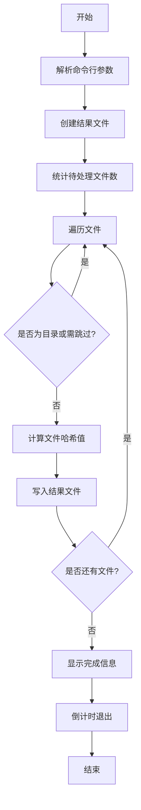

# HashSum 文件哈希校验工具

HashSum 是一个多平台文件哈希计算工具，支持计算文件的 MD5、SHA1、SHA256、SHA512 和 SM3（国密）哈希值。

## 功能特点

- 支持多种哈希算法：MD5、SHA1、SHA256、SHA512、SM3
- 支持单文件和目录批量处理
- 实时显示处理进度
- 自动跳过特定文件（如结果文件）
- 跨平台支持（Windows、Linux、macOS）
- CSV 格式输出，方便后续处理

## 使用方法

### 命令行参数

```bash
HashSum [-h 目录路径]
```

- `-h`: 指定要扫描的目录路径（可选，默认为当前目录）

### 示例

1. 扫描当前目录：
```bash
./HashSum
```

2. 扫描指定目录：
```bash
./HashSum -h /path/to/directory
```

## 构建说明

### 前置条件

- Go 1.16 或更高版本
- 网络连接（用于下载依赖）

### 构建步骤

1. 初始化项目：

Windows CMD:
```batch
init.bat
```

Windows PowerShell:
```powershell
.\init.ps1
```

Linux/macOS:
```bash
chmod +x init.sh
./init.sh
```

2. 构建程序：

Windows CMD:
```batch
build.bat
```

Windows PowerShell:
```powershell
.\build.ps1
```

Linux/macOS:
```bash
chmod +x build.sh
./build.sh
```

## 程序流程



## 输出格式

结果文件（CSV格式）包含以下列：
- 文件路径
- MD5
- SHA1
- SHA256
- SHA512
- SM3

示例输出：
```csv
文件路径,MD5,SHA1,SHA256,SHA512,SM3
example.txt,d41d8cd98f...,da39a3ee5e...,e3b0c44298...,cf83e1357e...,1ab21d8355...
```

## 支持的平台

- Windows (x86, x64, ARM64)
- Linux (x86, x64, ARM64)
- macOS (x64, ARM64)

## 注意事项

1. 程序会自动跳过以下文件：
   - 以 "result_" 开头的文件
   - 以 "HashSum" 开头的文件

2. 结果文件命名规则：
   - 当前目录：`HashSum_result_current.csv`
   - 指定目录：`HashSum_result_目录名.csv`

3. 进度显示：
   - 实时显示处理进度条
   - 显示已处理文件数/总文件数
   - 显示百分比进度

4. 程序结束：
   - 显示结果文件的完整路径
   - 10秒倒计时后自动退出

## 构建产物

构建后的文件位于 `build` 目录下，按照操作系统和架构分类：
```
build/
├── windows-amd64-v1.0.0/
│   └── HashSum.exe
├── linux-amd64-v1.0.0/
│   └── HashSum
└── darwin-amd64-v1.0.0/
    └── HashSum
```
hash_generator.go

## 开发说明

1. 主要源文件：
   - `hash_generator.go`: 主程序源码
   - `build.bat`/`build.ps1`/`build.sh`: 构建脚本
   - `init.bat`/`init.ps1`/`init.sh`: 初始化脚本

2. 依赖项：
   - `github.com/tjfoc/gmsm/sm3`: 国密SM3算法实现

## 许可证

[MIT License](LICENSE)
